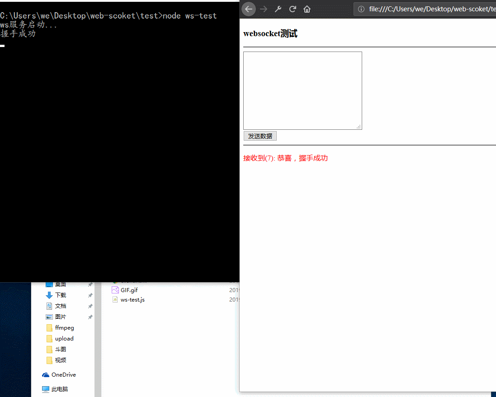

# 一个简单的nodejs websocket服务类

*几行简单的代码即可实现wensocket通信*

```javascript
const Ws = require("./ws.js");

let server = new Ws(8080);

server.onOpen = ()=>{
    console.log("有新的链接");
}

server.onMessage = msg=>{
    console.log("客户端来消息啦：" + msg);
}

server.onError = msg=>{
    console.log("服务端发生错误：" + msg);
}

```

## 简介

> 某一天，想做一个网页版的视频转换，后端使用ffmpeg，想通过websocket来通知前端ffmpeg处理进度；速速去npm搜了一把，忙活半天，感觉这些包都太重了。后自己决定研究一把websocket数据帧，所以诞生了这个类。


*效果如图（gif）*



## 关于websocket数据帧的相关参考资料
* [MDN](https://developer.mozilla.org/zh-CN/docs/Web/API/WebSockets_API/Writing_WebSocket_servers)
  
*笔记后续完善*